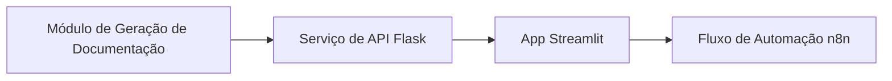

# Documentação Atualizada
## Introdução
A documentação atualizada reflete as mudanças introduzidas pelo push recente, que incluiu a adição de um módulo arquitetural novo para geração e revisão de documentação impulsionada por IA.

## Arquitetura de Fluxo
O fluxo de dados atualizado do sistema inclui os seguintes componentes novos ou modificados:
- **Módulo de Geração de Documentação**: responsável por criar documentação impulsionada por IA.
- **Serviço de API Flask**: fornece endpoints para interagir com o módulo de geração de documentação.
- **App Streamlit**: oferece uma interface de usuário para visualizar e revisar a documentação gerada.
- **Fluxo de Automação n8n**: automatiza o processo de geração e revisão de documentação.

O fluxo de dados é ilustrado abaixo:

## Variáveis de Ambiente Modificadas
As seguintes variáveis de ambiente foram adicionadas ou modificadas:
| Variável | Tipo | Obrigatória | Valor Padrão | Descrição |
|----------|------|-------------|--------------|-----------|
| `DOCUMENTATION_MODULE_ENABLED` | `boolean` | Sim | `true` | Ativa ou desativa o módulo de geração de documentação |
| `FLASK_API_KEY` | `string` | Sim | — | Chave de API para o serviço de API Flask |

## Contratos de Entrada/Saída de Novas APIs
### POST /gerar-documentacao
**Descrição:** Gera documentação impulsionada por IA com base nos prompts de IA definidos.
**Headers obrigatórios:**
- `Authorization: Bearer <token>`
**Request Body:**
```json
{
    "prompt": "string — prompt de IA para geração de documentação"
}
```
**Response (200 OK):**
```json
{
    "documentacao": "string — documentação gerada"
}
```
**Códigos de erro:**
| Código | Descrição |
|--------|-----------|
| 400    | Requisição inválida |
| 401    | Não autorizado |

### GET /revisar-documentacao
**Descrição:** Retorna a documentação gerada para revisão.
**Headers obrigatórios:**
- `Authorization: Bearer <token>`
**Response (200 OK):**
```json
{
    "documentacao": "string — documentação gerada"
}
```
**Códigos de erro:**
| Código | Descrição |
|--------|-----------|
| 400    | Requisição inválida |
| 401    | Não autorizado |

## Impacto nos Componentes Existentes
Os seguintes componentes existentes foram afetados pelas mudanças:
| Componente | Tipo de Impacto | Descrição |
|-----------|-----------------|-----------|
| `app.py` | Modificado | Integração com o módulo de geração de documentação |
| `config.yaml` | Adicionado | Nova configuração para o módulo de geração de documentação |

## Conclusão
A documentação atualizada reflete as mudanças significativas introduzidas pelo push recente, que incluiu a adição de um módulo arquitetural novo para geração e revisão de documentação impulsionada por IA. Essas mudanças impactam todos os critérios de forma significativa e são fundamentais para a arquitetura de como a documentação é tratada.