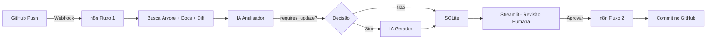

# Kensei CyberAI Playground

## Saudações

Olá! Este repositório acompanha minha jornada na formação **Kensei AI Foundations 2026**, onde desenvolvi habilidades práticas em programação, análise de dados, inteligência artificial e automação, usando vibe coding, n8n, streamlit e gemini AI.

## Propósito

- Consolidar os aprendizados de cada semana da formação Kensei AI Foundations.
- Registrar scripts, dashboards, workflows e projetos construídos ao longo do curso.
- Documentar a evolução prática em Python, Pandas, Streamlit, n8n e integração com modelos de IA (Gemini).

## Estrutura do Repositório

```text
kensei-cyberAI/
│
├── vibe_coding/            # Semana 2 — Scripts Python com Vibe Coding
├── analise_dados/          # Semanas 3 e 4 — Dashboard de Custo de Vida Global
├── n8n/                    # Semanas 5 e 6 — Workflows e automações no n8n
├── slides/                 # Material de apoio das aulas (PDFs dos slides)
├── projeto-final/          # Semana 8 — Projeto Final: Code Review & Doc Generator
├── relatorio.md            # Relatório de conclusão do curso
└── README.md               # Este arquivo
```

---

## Segunda Semana — Vibe Coding

Na segunda semana, foram criados scripts simples usando IA para praticar lógica em Python, manipulação de arquivos, menus interativos, contagem de palavras, geração de senhas, organização de arquivos, quiz com tempo e um scanner de portas básico.

**Scripts desenvolvidos:**

| Script | Descrição |
|---|---|
| `celsius_para_fahrenheit.py` | Conversor de temperatura nos dois sentidos |
| `lista_compras.py` | Lista de compras com salvar em arquivo |
| `gerador_senhas.py` | Gerador de 5 senhas com opções de complexidade |
| `quiz_cyber.py` | Quiz de cibersegurança com tempo por pergunta |
| `organizar_arquivos.py` | Organizador de arquivos por tipo com log |
| `scanner_portas_basico.py` | Scanner TCP com relatório salvo em `.txt` |
| `contador_palavras.py` | Contador de frequência de palavras em arquivos |

Para ver o resumo detalhado dos códigos e o que cada script faz, acesse o arquivo da semana em [semana_2.md](vibe_coding/semana_2.md).

---

## Semanas 3 e 4 — Análise de Dados e IA

Nas semanas 3 e 4, mergulhamos na análise de dados construindo um Dashboard interativo de "Custo de Vida Global". Utilizamos `Pandas` para estruturar os dados e `Plotly` para ricas visualizações (como mapas e dispersão). Tudo foi envelopado num portal moderno criado com `Streamlit`. A cereja do bolo foi integrar o modelo de IA **Gemini 2.5 Flash** diretamente na barra lateral, permitindo extrair insights dos dados conversando com o dashboard em linguagem natural.

**Tecnologias utilizadas:** Python · Pandas · Plotly · Streamlit · Google Gemini AI

Para ver todos os detalhes, arquivos envolvidos e aprender a executar o dashboard localmente, acesse [semana_3_4.md](analise_dados/semana_3_4.md).

---

## Semanas 5 e 6 — Automação e Agentes com n8n

Nas semanas 5 e 6, exploramos automação no-code/low-code com a plataforma **n8n**, instalada via Docker. Aprendemos a construir workflows visuais conectando triggers, nós de execução e integrações externas para automatizar tarefas repetitivas. Na semana 6, evoluímos para **agentes inteligentes de IA** dentro do n8n, combinando LLMs com ferramentas externas para criar fluxos autônomos.

**Workflows criados:**

| Workflow | Descrição |
|---|---|
| [Frases Motivacionais](n8n/frases%20motivacionais/README.md) | Gera frases com Gemini e salva no Google Sheets |
| [Monitoramento de Site](n8n/monitoramento%20site/README.md) | Monitora disponibilidade de sites e envia alertas por e-mail |

Para rodar o n8n localmente e importar os workflows, consulte o [README do n8n](n8n/README.md).

---

## Semana 7 — Aplicações Web com Streamlit

Na semana 7, aprendemos a transformar scripts Python em aplicações web completas e visuais usando **Streamlit**, sem precisar escrever HTML, CSS ou JavaScript. Também integramos o frontend com webhooks para disparar fluxos nos agentes e automações construídos no n8n — uma habilidade essencial para o projeto final.

---

## Semana 8 — Projeto Final: Code Review & Documentation Generator

O projeto final consolidou todos os aprendizados do curso num sistema de **automação inteligente de documentação técnica**. O pipeline analisa commits Git, gera documentação com IA (Gemini) e permite revisão humana antes da publicação no repositório.



**Stack do projeto:**

| Componente | Função |
|---|---|
| **n8n (Fluxo 1)** | Recebe o push, busca dados no GitHub, envia para análise/geração por IA, salva no SQLite |
| **n8n (Fluxo 2)** | Recebe aprovação do Streamlit e faz commit do README atualizado no GitHub |
| **Flask API** | Ponte entre n8n e SQLite — recebe os dados da IA e insere no banco |
| **Streamlit** | Interface de revisão humana — visualizar, editar, aprovar ou rejeitar a documentação |
| **Gemini AI** | Modelo de IA que analisa o impacto do commit e gera a documentação atualizada |

Para instalação completa, configuração dos workflows, tokens e teste end-to-end, acesse o [README do Projeto Final](projeto-final/README.md).


---

## Prompt do Autor

> esse repositório é para estudos do curso da kensei de cyberAI.
> gere um arquivo readme.md contendo saudações e esse prompt que estou escrevendo.
> utilize um tema que remeta a cyber segurança e inteligencia artificial.
> adicione figuras e gifs que façam sentido com o tema.