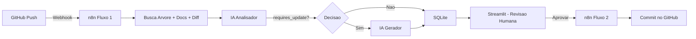

# Code Review & Documentation Generator

Automacao inteligente que analisa commits Git, gera documentacao tecnica com IA (Gemini) e permite revisao humana antes da publicacao no repositorio.

---

## Arquitetura



**Componentes:**

| Componente | Funcao |
|---|---|
| **n8n (Fluxo 1)** | Recebe o push, busca dados no GitHub, envia para analise/geracao por IA, salva no SQLite |
| **n8n (Fluxo 2)** | Recebe aprovacao do Streamlit e faz commit do README atualizado no GitHub |
| **Flask API** | Ponte entre n8n e SQLite — recebe os dados da IA e insere no banco |
| **Streamlit** | Interface de revisao humana — visualizar, editar, aprovar ou rejeitar a documentacao |
| **Gemini AI** | Modelo de IA que analisa o impacto do commit e gera a documentacao atualizada |

---

## Pre-requisitos

| Ferramenta | Versao Minima | Para que |
|---|---|---|
| Python | 3.10+ | Flask API + Streamlit |
| n8n | 1.0+ | Orquestracao dos workflows |
| Git | 2.30+ | Controle de versao |
| Conta GitHub | — | Repositorio + API + Webhooks |
| Google AI Studio | — | API Key do Gemini |

---

## Instalacao Passo a Passo

### 1. Clonar o repositorio

```bash
git clone git@github.com:Gabriela-Amaro/Kensei-CyberAI.git
cd projeto-final
```

### 2. Instalar dependencias Python

```bash
pip install -r requirements.txt
```

### 3. Instalar o n8n

**Opcao A — Docker (recomendado):**
```bash
docker run -d --name n8n \
  -p 5678:5678 \
  -v n8n_data:/home/node/.n8n \
  n8nio/n8n
```

**Opcao B — npm:**
```bash
npm install -g n8n
n8n start
```

Acesse o n8n em: **http://localhost:5678**

---

## Obter Tokens e API Keys

### GitHub Personal Access Token

1. Acesse **GitHub > Settings > Developer Settings > Personal Access Tokens > Fine-grained tokens**
2. Clique em **"Generate new token"**
3. Permissoes necessarias:
   - **Contents**: Read and Write
   - **Webhooks**: Read and Write
   - **Metadata**: Read-only
4. Copie e guarde o token (ele nao sera exibido novamente)

### Google Gemini API Key

1. Acesse **https://aistudio.google.com/apikey**
2. Clique em **"Create API Key"**
3. Copie a chave gerada

---

## Importar e Configurar os Workflows no n8n

### Passo 1 — Importar os arquivos JSON

1. Abra o n8n em **http://localhost:5678**
2. Clique no menu **"..."** (tres pontinhos no canto superior direito)
3. Selecione **"Import from File"**
4. Importe o arquivo `n8n/workflow_fluxo1_analise.json`
5. Repita o processo para `n8n/workflow_fluxo2_publicacao.json`

### Passo 2 — Configurar a credencial do GitHub

Apos importar, todos os nos HTTP que acessam a API do GitHub aparecerao com credencial invalida. Configure uma vez e reutilize:

1. Clique em qualquer no HTTP (ex: `HTTP Arvore`)
2. Em **Authentication**, selecione **Generic Credential Type > Header Auth**
3. Clique em **"Create New Credential"** e preencha:
   - **Name:** `GitHub Token`
   - **Header Name:** `Authorization`
   - **Header Value:** `Bearer ghp_SEU_TOKEN_AQUI`
4. Salve a credencial
5. Nos demais nos HTTP (`HTTP Docs`, `HTTP Diff`, `HTTP Buscar SHA`, `Executar Commit`), selecione a mesma credencial `GitHub Token`

### Passo 3 — Configurar a credencial do Gemini

1. Clique no no **`Gemini Analisador`** (icone do Google, abaixo do IA Analisador)
2. Clique em **"Create New Credential"** para Google Gemini
3. Cole sua **API Key** do Google AI Studio
4. Salve a credencial
5. Repita no no **`Gemini Gerador`** (selecione a mesma credencial)

### Passo 4 — Ajustar a URL do Flask (Salvar no SQLite)

No no **`Salvar no SQLite`** (ultimo no do Fluxo 1), ajuste a URL conforme seu ambiente:

| Ambiente do n8n | URL |
|---|---|
| **Docker** | `http://host.docker.internal:5000/insert-doc` |
| **npm/local** | `http://localhost:5000/insert-doc` |

### Passo 5 — Publicar os workflows

1. Em cada workflow, clique no botao **"Publish"** (canto superior direito)
2. Mude de "Inactive" para **"Active"**

> **Importante:** Os webhooks so funcionam quando o workflow esta publicado e ativo.

---

## Configurar o GitHub Webhook

Para que o GitHub notifique o n8n a cada push:

1. Acesse seu repositorio no GitHub
2. Va em **Settings > Webhooks > Add webhook**
3. Configure:
   - **Payload URL:** URL de producao do Webhook 1 do n8n
     - Se local, use um tunel como [ngrok](https://ngrok.com): `ngrok http 5678`
     - A URL sera algo como: `https://xxxx.ngrok-free.dev/webhook/github-push`
   - **Content type:** `application/json`
   - **Events:** Selecione **"Just the push event"**
4. Clique em **"Add webhook"**

---

## Configurar e Rodar a Aplicacao Python

### 1. Configurar o Streamlit secrets

Edite (ou crie) o arquivo `.streamlit/secrets.toml`:

```toml
N8N_PUBLISH_WEBHOOK_URL = "http://localhost:5678/webhook/publish-docs"
```

> Se estiver usando ngrok, substitua pela URL publica:
> ```toml
> N8N_PUBLISH_WEBHOOK_URL = "https://xxxx.ngrok-free.dev/webhook/publish-docs"
> ```

### 2. Iniciar a API Flask

Em um terminal:

```bash
python api_receiver.py
```

Saida esperada:
```
API Receiver rodando em http://localhost:5000
```

### 3. Iniciar o Streamlit

Em outro terminal:

```bash
streamlit run app.py
```

Acesse: **http://localhost:8501**

---

## Teste End-to-End

1. Certifique-se de que tudo esta rodando:
   - [ ] n8n ativo com os dois workflows publicados
   - [ ] Flask API rodando na porta 5000
   - [ ] Streamlit rodando na porta 8501
   - [ ] GitHub Webhook configurado e apontando para o n8n

2. Faca um **push** no repositorio monitorado:
   ```bash
   echo "# teste" >> README.md
   git add . && git commit -m "test: trigger workflow" && git push
   ```

3. Acompanhe no n8n (aba **"Executions"**) o fluxo sendo executado

4. Abra o Streamlit — a documentacao gerada aparecera como **Pendente**

5. Revise, edite se necessario, e clique em **"Aprovar e Publicar"**

6. Verifique no GitHub que o README.md foi atualizado automaticamente

---

## Estrutura do Projeto

```
projeto-final/
├── .streamlit/
│   └── secrets.toml              # URL do webhook de publicacao
├── n8n/
│   ├── workflow_fluxo1_analise.json    # Workflow importavel: GitHub Push > IA > SQLite
│   ├── workflow_fluxo2_publicacao.json # Workflow importavel: Aprovacao > Commit GitHub
│   └── workflow_nodes.js               # Codigo-fonte dos nos (referencia)
├── prompts/
│   ├── prompt_01_analisador_contexto.md  # System prompt do analisador
│   └── prompt_02_gerador_documentacao.md # System prompt do gerador
├── api_receiver.py               # API Flask — ponte entre n8n e SQLite
├── app.py                        # Interface Streamlit de revisao humana
├── database.db                   # Banco SQLite (criado automaticamente)
├── requirements.txt              # Dependencias Python
└── README.md                     # Este arquivo
```

---

## Solucao de Problemas

| Problema | Solucao |
|---|---|
| Webhook do GitHub retorna erro | Verifique se o n8n esta ativo e o workflow publicado. Use ngrok se estiver local. |
| `ECONNREFUSED` no no Salvar no SQLite | Ajuste a URL: use `host.docker.internal` se o n8n roda em Docker. |
| IA nao retorna JSON valido | O no `Parse da Resposta` tenta limpar a saida. Verifique os logs no n8n. |
| Streamlit nao mostra documentacoes | Confirme que a Flask API esta rodando e que o push gerou dados no `database.db`. |
| Erro de credencial no no HTTP | Reconfigure a credencial Header Auth com o token do GitHub atualizado. |

---

## Sugestoes de Melhoria para a IA

A qualidade da documentacao gerada depende diretamente de como os prompts sao escritos e de quais tecnicas de engenharia de prompt sao aplicadas. Abaixo estao sugestoes praticas para evoluir o sistema.

### 1. Estruturar o System Prompt com secoes claras

Um system prompt eficaz segue uma estrutura previsivel. A IA responde melhor quando o prompt tem blocos bem definidos:

```
PAPEL: Quem a IA deve ser (persona, experiencia, especialidade)
CONTEXTO: O que ela vai receber como entrada
INSTRUCOES: O que ela deve fazer, passo a passo
RESTRICOES: O que ela NAO deve fazer
FORMATO DE SAIDA: Estrutura exata esperada na resposta
```

**Exemplo aplicado ao analisador:**

```
PAPEL:
Voce e um engenheiro de documentacao tecnica senior.

CONTEXTO:
Voce recebera a arvore de arquivos, a documentacao atual e o git diff de um push recente.

INSTRUCOES:
1. Analise se o diff introduziu funcionalidades novas, mudancas de API, ou alteracoes de configuracao.
2. Classifique o impacto como Low, Medium ou High.
3. Justifique citando arquivos e trechos especificos do diff.

RESTRICOES:
- Nao considere mudancas puramente cosmeticas (formatacao, comentarios).
- Nao invente funcionalidades que nao existem no diff.
- Nao adicione campos alem dos especificados.

FORMATO DE SAIDA:
Responda exclusivamente com JSON no formato:
{"requires_update": bool, "justification": "string", "impact_level": "Low|Medium|High"}
```

### 2. Usar Few-Shot Examples (exemplos dentro do prompt)

Incluir 1-2 exemplos de entrada/saida no system prompt melhora drasticamente a consistencia. A IA aprende o padrao esperado por imitacao:

```
EXEMPLO 1:
Entrada: Diff que adiciona um novo endpoint POST /api/users
Saida esperada:
{
  "requires_update": true,
  "justification": "O diff adiciona o endpoint POST /api/users em routes/users.py (linhas 45-67), introduzindo um novo contrato de API que precisa ser documentado.",
  "impact_level": "Medium"
}

EXEMPLO 2:
Entrada: Diff que corrige um typo em um comentario
Saida esperada:
{
  "requires_update": false,
  "justification": "A alteracao e puramente cosmetica, corrigindo um typo no comentario do arquivo utils.py (linha 12). Nenhum comportamento foi modificado.",
  "impact_level": "Low"
}
```

### 3. Injetar um Template de Documentacao

Em vez de deixar a IA decidir a estrutura do documento, forneca um template esqueleto no prompt do gerador. Isso garante consistencia entre execucoes:

```
Gere a documentacao seguindo EXATAMENTE este template. Preencha as secoes
relevantes e remova as que nao se aplicam:

# Nome do Projeto

## Visao Geral
[Descricao breve do projeto]

## Arquitetura
[Diagrama mermaid do fluxo de dados]

## Instalacao
[Passos para instalar e configurar]

## Endpoints da API
### [METHOD] /caminho
- Descricao:
- Request Body:
- Response:
- Codigos de Erro:

## Variaveis de Ambiente
| Variavel | Tipo | Obrigatoria | Descricao |

## Changelog
| Data | Mudanca |
```

### 4. Aplicar Chain-of-Thought (cadeia de raciocinio)

Pedir para a IA "pensar antes de responder" produz analises mais precisas. Adicione ao system prompt:

```
Antes de gerar sua resposta final, siga estes passos internamente:

1. Liste todos os arquivos modificados no diff.
2. Para cada arquivo, identifique se a mudanca afeta interface publica, logica de negocio ou configuracao.
3. Cruze com a documentacao atual para verificar o que ja esta documentado.
4. So entao decida se requires_update e true ou false.
```

### 5. Adicionar Skills (ferramentas conectadas ao AI Agent)

O n8n permite conectar ferramentas (tools) ao no AI Agent, expandindo as capacidades da IA:

| Skill | Como implementar | Beneficio |
|---|---|---|
| **Buscar conteudo de arquivo** | HTTP Request Tool que acessa `api.github.com/repos/.../contents/{path}` | A IA pode ler o codigo-fonte completo de um arquivo, nao apenas o diff |
| **Buscar issues abertas** | HTTP Request Tool que acessa `api.github.com/repos/.../issues` | A IA pode correlacionar mudancas com issues do projeto |
| **Buscar README de outros repos** | HTTP Request Tool parametrizada | A IA pode usar documentacoes de referencia como exemplo de qualidade |
| **Calculadora de metricas** | Code Tool que conta linhas adicionadas/removidas | Dada objetiva para a IA classificar o impacto |

Para adicionar uma skill no n8n:
1. No no AI Agent, clique no conector **"Tool"** (icone de ferramenta)
2. Adicione um no **"HTTP Request Tool"** ou **"Code Tool"**
3. A IA decidira automaticamente quando usar a ferramenta com base no contexto

### 6. Definir um Padrao de Qualidade (rubrica)

Adicione criterios de qualidade ao system prompt do gerador para que a IA se auto-avalie:

```
Antes de retornar a documentacao final, verifique:

- [ ] Toda funcao publica nova tem descricao, parametros e retorno documentados?
- [ ] Todo endpoint novo tem method, path, request body, response e codigos de erro?
- [ ] Variaveis de ambiente novas estao listadas com tipo e descricao?
- [ ] Os exemplos de codigo sao funcionais e nao contem placeholders genericos?
- [ ] O tom e consistente com o restante do documento?
- [ ] Nenhuma secao existente foi removida sem justificativa?

Se algum criterio nao foi atendido, corrija antes de responder.
```

### 7. Separar analise em multiplos agentes especializados

Em vez de um unico agente gerador, considere dividir em agentes com responsabilidades menores:

```
Agente 1 (Analisador)     -> Decide se precisa atualizar (ja existe)
Agente 2 (Planejador)     -> Lista exatamente quais secoes devem ser criadas/alteradas
Agente 3 (Gerador)        -> Gera apenas o conteudo das secoes indicadas pelo planejador
Agente 4 (Revisor)        -> Valida a qualidade e consistencia do resultado
```

Cada agente recebe um system prompt menor e mais focado, o que reduz alucinacoes e melhora a precisao.

### 8. Usar temperatura baixa para consistencia

Nos nos Google Gemini Chat Model do n8n, configure:

- **Temperature:** `0.1` a `0.3` (menor = mais deterministico e consistente)
- **Top-P:** `0.9`

Temperatura alta (> 0.7) gera respostas mais criativas mas menos previsiveis, o que nao e desejavel para documentacao tecnica.

---

## Licenca

Este projeto e de uso academico e educacional.
