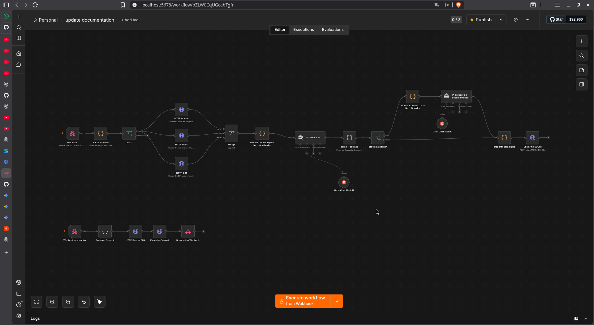
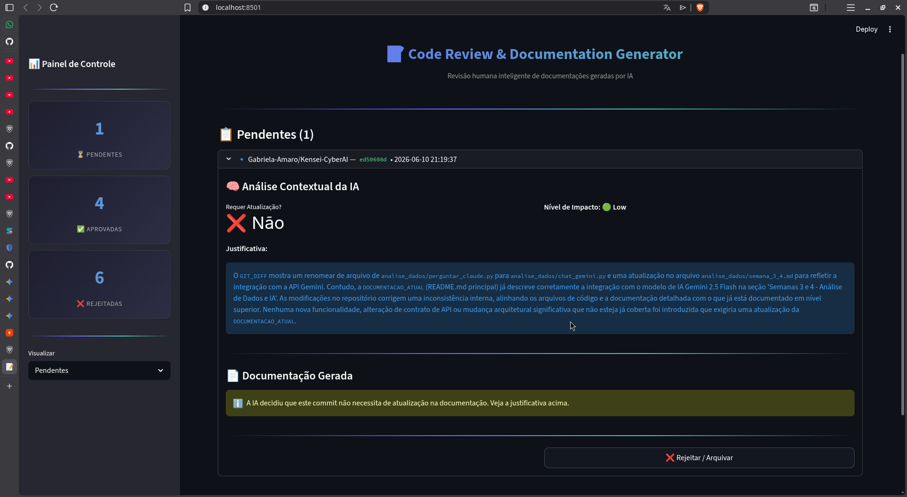

# Relatório de Conclusão: Kensei AI Foundations 2026

* **Aluno:** Gabriela Amaro
* **Turma:** Kensei AI Foundations 2026
* **Data:** Junho de 2026

---

## 1. Resumo por Semana & Insights

### Semana 1: Aula Inaugural e Alinhamento
* **O que aprendi:** Compreendi o ecossistema de Inteligência Artificial, diferenciando Machine Learning, Deep Learning e os Large Language Models (LLMs). Entendi a revolução provocada pela arquitetura Transformer (Self-Attention) desenvolvida em 2017 e como as ferramentas que usamos hoje nasceram ali. Também fiz o setup inicial criando meu repositório no GitHub.
* **Insight pessoal:** Perceber que IA é um cálculo probabilístico baseado em tokens, mudou minha forma de interagir com os prompts. 

### Semana 2: Python do Zero e Vibe Coding
* **O que aprendi:** Fui introduzida ao conceito de "Vibe Coding", onde o foco migra de decorar sintaxe para dominar a lógica de programação, sabendo ler, testar e iterar o código gerado em coparticipação com a IA. Na prática, construí 7 scripts em Python: um conversor de temperatura (Celsius/Fahrenheit), uma lista de compras interativa com persistência em arquivo, um gerador de senhas com opções de complexidade, um quiz de cibersegurança com timer de 10 segundos por pergunta, um organizador de arquivos por tipo (imagens, documentos, vídeos) com log, um scanner de portas TCP com relatório salvo em `.txt` e um contador de frequência de palavras.
* **Insight pessoal:** Usar a IA para debugar e explicar o código linha por linha acelerou meu aprendizado. Percebi que o importante não é escrever cada linha do zero, mas entender o que cada linha faz e saber iterar quando algo dá errado.

### Semana 3: Análise de Dados com Pandas e Plotly
* **O que aprendi:** Aprendi a lidar com o ecossistema de dados do Python. Utilizei a biblioteca Pandas para carregar um dataset de Custo de Vida Global (CSV), limpando dados faltantes e inconsistentes com o script `limpar_dados.py`. Para visualização, utilizei Plotly (Express e Graph Objects) para criar mapas interativos e gráficos de correlação/dispersão, em vez do Matplotlib tradicional. Todo o dashboard foi construído com Streamlit, com tema Dark Mode configurado via `.streamlit/config.toml`.
* **Insight pessoal:** Entender que 80% do trabalho com dados é limpar e tratar informação suja me fez ver a importância de ter um pipeline de limpeza estruturado. Plotly + Streamlit se mostraram uma ótima combinação para transformar dados brutos em algo que qualquer pessoa consegue explorar.

### Semana 4: Conectando com APIs de IA
* **O que aprendi:** Descobri como dar "cérebro" aos meus scripts Python conectando-os diretamente à API do Google Gemini (modelo 2.5 Flash). Integrei um chat de IA na barra lateral do dashboard de Custo de Vida, onde o Gemini recebe dinamicamente um system prompt contendo o dicionário dos dados em português, resumo estatístico (médias, min, max, quartis) da tabela filtrada e amostras brutas — permitindo perguntas em linguagem natural como "Qual cidade tem o aluguel mais caro comparado ao salário?". Aprendi boas práticas de segurança de código, como o uso de variáveis de ambiente (`.env`) e `.gitignore` para nunca expor chaves de API no GitHub.
* **Insight pessoal:** Ver que um chat integrado com IA pode transformar um dashboard estático em uma experiência 'conversa-com-dados' me mostrou o verdadeiro poder de conectar APIs de IA a aplicações reais. A IA deixou de ser um chatbot isolado e virou parte funcional do meu projeto.

### Semana 5: Automação Visual com n8n
* **O que aprendi:** Explorei automação no-code/low-code usando o n8n, instalado via Docker com volume persistente para não perder workflows e credenciais ao fechar o container. Construí dois workflows: (1) **Frases Motivacionais** — ao acionar o Manual Trigger, o workflow chama a API do Gemini 2.5 Flash, gera uma frase motivacional em português e salva numa planilha do Google Sheets com data e frase; (2) **Monitoramento de Site** — roda automaticamente a cada 5 minutos, verifica se o site `cajui.ifnmg.edu.br` responde com sucesso e envia um e-mail de alerta via SMTP caso esteja fora do ar.
* **Insight pessoal:** Automatizar tarefas repetitivas nos devolve o tempo necessário para focar em decisões estratégicas. Configurar o workflow de monitoramento e ver ele funcionando sozinho a cada 5 minutos, sem precisar de código, me fez entender por que o mercado de automação está explodindo.

### Semana 6: Agentes Inteligentes no n8n
* **O que aprendi:** Dei o salto de workflows reativos para agentes autônomos de IA. Aprendi que um agente combina um LLM de base, instruções de sistema claras, memória de contexto e acesso a ferramentas externas (como calculadoras, buscas na Wikipedia ou APIs de segurança). O agente passou a decidir sozinho a melhor rota para atingir o objetivo proposto. Esse conhecimento foi essencial para o projeto final, onde utilizei dois modelos Gemini (Analisador e Gerador) orquestrados pelo n8n como agentes especializados.
* **Insight pessoal:** Entender a diferença entre um workflow sequencial e um agente que decide seus próprios passos foi essencial para a expansão do meu pensar. Percebi que a engenharia de prompt é tão importante quanto o código, o system prompt define a qualidade do resultado.

### Semana 7: Aplicações Web com Streamlit
* **O que aprendi:** Aprendi a transformar scripts Python de terminal em aplicações web completas e visuais utilizando o Streamlit, sem precisar escrever uma única linha de HTML, CSS ou JavaScript. Além disso, compreendi como fazer a integração do frontend no Streamlit disparando webhooks para os agentes e fluxos construídos no n8n. Essa habilidade foi diretamente aplicada no projeto final, onde o Streamlit serviu como interface de revisão humana.
* **Insight pessoal:** Construir uma interface amigável é o que transforma uma lógica de código excelente em um produto real que qualquer pessoa consegue utilizar. O Streamlit mostrou que a barreira entre 'script no terminal' e 'aplicação web' pode ser baixa.

### Semana 8: Projeto Final e Demo Day
* **O que aprendi:** Consolidei o conhecimento de todas as semanas para construir o **Code Review & Documentation Generator** — um sistema que automatiza a geração de documentação técnica a partir de commits Git. O pipeline completo funciona assim: um push no GitHub dispara um webhook no n8n (Fluxo 1), que busca a árvore de arquivos, documentação atual e git diff via API do GitHub. Esses dados são enviados para o Gemini Analisador (com um system prompt estruturado com critérios de avaliação), que decide se a documentação precisa ser atualizada. Em caso positivo, o Gemini Gerador produz a documentação atualizada seguindo um padrão corporativo. O resultado é salvo no SQLite via Flask API e aparece no Streamlit para revisão humana. Ao aprovar, o Fluxo 2 do n8n faz o commit automaticamente no GitHub.
* **Insight pessoal:** Juntar todas as peças — Python, Flask, Streamlit, n8n, Gemini AI, GitHub API — num único sistema funcional me mostrou que o verdadeiro valor da formação não foi aprender cada ferramenta isolada, mas sim saber integrá-las. Resolver problemas reais como DNS do Docker, parsing de JSON da IA e fluxos de aprovação humana me deu confiança para encarar projetos de automação mais complexos.

---

## 2. Projetos que Construí

Ao longo das 8 semanas, desenvolvi e versionei os seguintes projetos práticos no meu portfólio:

### Code Review & Documentation Generator (Projeto Final)
* **Link do Repositório:** [`projeto-final/`](https://github.com/Gabriela-Amaro/Kensei-CyberAI/tree/main/projeto-final)
* **Descrição:** Sistema de automação inteligente que analisa commits Git, gera documentação técnica com IA (Gemini) e permite revisão humana antes da publicação no repositório. Stack: n8n (orquestração) + Flask API (persistência SQLite) + Streamlit (interface de revisão) + Google Gemini AI (análise e geração). Inclui dois workflows n8n importáveis, prompts de engenharia de prompt documentados e guia completo de instalação.
* **Prints do Projeto:**

### Labs e Desafios Semanais:
* **Semana 2 (Vibe Coding):** 7 scripts Python — conversor de temperatura, lista de compras interativa, gerador de senhas seguras, quiz de cibersegurança com timer, organizador de arquivos por tipo, scanner de portas TCP e contador de palavras.
* **Semanas 3-4 (Dados + IA):** Dashboard interativo de Custo de Vida Global construído com Pandas + Plotly + Streamlit, integrado com chat Gemini AI na barra lateral para consultas em linguagem natural sobre o dataset.
* **Semana 5 (Workflows n8n):** Automação de frases motivacionais com Gemini + Google Sheets e monitoramento de disponibilidade de site com alerta por e-mail (SMTP).
* **Semana 7 (Streamlit):** Interface de revisão humana para o projeto final, com visualização de documentações pendentes, editor integrado e botão de aprovação que dispara webhook para o n8n.

---

## 3. O Que Mudou em Mim (Reflexão Pessoal)

O curso me fez entender como integrar via API e n8n para servir como motores de decisão em sistemas complexos. A mentalidade 'AI-first' mudou minha forma de abordar qualquer problema, antes de escrever código manualmente, penso em como a IA pode me ajudar a iterar mais rápido, e antes de fazer uma tarefa repetitiva, penso em como automatizá-la. 
Mas o mais importante de tudo, o curso me fez perceber que o limite é a minha imaginação. O que antes precisava de conhecimento profundo e muito tempo de dedicação, hoje é feito e aprendido com muito mais velocidade.

---

## 4. Próximos Passos (Planejamento para os próximos 3 meses)

1. **Mês 1:** Implementar os agentes especializados sugeridos na documentação do projeto final (Planejador, Gerador, Revisor) para reduzir alucinações e melhorar a precisão da documentação.
2. **Mês 2:** Aplicar as habilidades de automação aprendidas na formação em um projeto pessoal ou profissional real, documentando o processo.
3. **Mês 3:** Estudar RAG (Retrieval-Augmented Generation) para permitir que a IA consulte bases de conhecimento antes de gerar respostas, melhorando a precisão em domínios específicos.